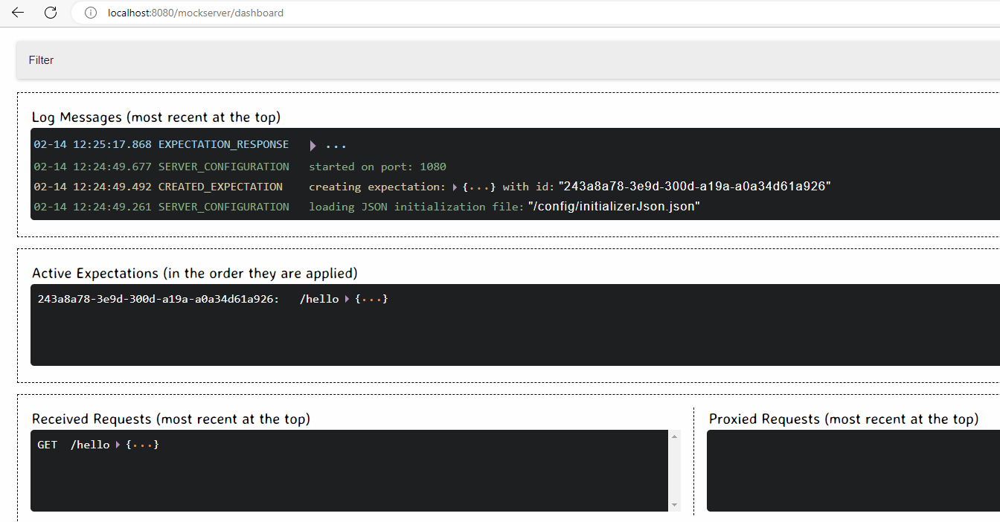

# mockserver-operator

This project uses Quarkus, the Supersonic Subatomic Java Framework.

The goal of this project is to demonstrate with a practical example how to implement a Kubernetes operator using [Quarkus](https://quarkus.io/) and the [Java Operator SDK](https://javaoperatorsdk.io/).
This operator manages the creation/update of one or more mockserver instances preconfigured with the setup defined in the CRD.
Although this example is very simple, it represents an excellent template of an operator as it allows you to manage the configuration and updating of many "secondary resources". Starting from this example it is possible to solve more complex cases.

...


# HOW TO USE

## Run locally from code
First you neet to configure your `~/. kube/config` because, when run locally the framework will use your Kubernetes client configuration to establish a connection to the cluster.

You can clone the git repository and run the application locally:
```shell script
./mvnw compile quarkus:dev
```
this give you the opportunity to debug the code if you want.

## Install the operator
TBD


# Use it
The operator create a new CRD named `Mockserver` that can be used to define our new Mockserver objects.

We can create a simple new Mockserver as the following:

```shell
kubectl apply -f - <<EOF
apiVersion: "rmarcello.mockserveroperator/v1"
kind: Mockserver
metadata:
  name: mockserver-test
spec:
  replica: 1
  image: mockserver/mockserver:latest
  ingressHost: mockserver.local
  config: |
    [
    {
      "httpRequest": {
        "path": "/hello"
      },
      "httpResponse": {
        "statusCode": 200,
        "body": {
          "json": {
            "message": "Hello World"
          }
        }
      }
    }
    ]
EOF
```

we can see the following:

```shell
$ kubectl get Mockserver
NAME              AGE
mockserver-test   26m

$ kubectl get svc
NAME              TYPE        CLUSTER-IP    EXTERNAL-IP   PORT(S)    AGE
mockserver-test   ClusterIP   10.106.5.11   <none>        8080/TCP   9m13s

$ kubectl get deploy
NAME              READY   UP-TO-DATE   AVAILABLE   AGE
mockserver-test   1/1     1            1           9m43s

$ kubectl get cm
NAME               DATA   AGE
mockserver-test    1      10m

$ kubectl get mockserver mockserver-test -oyaml
apiVersion: rmarcello.mockserveroperator/v1
kind: Mockserver
metadata:
  finalizers:
  - mockservers.rmarcello.mockserveroperator/finalizer
  generation: 1
  name: mockserver-test
  namespace: default
spec:
  config: |
    [
    {
      "httpRequest": {
        "path": "/hello"
      },
      "httpResponse": {
        "statusCode": 200,
        "body": {
          "json": {
            "message": "Hello World"
          }
        }
      }
    }
    ]
  image: mockserver/mockserver:latest
  ingressHost: mockserver.local
  replica: 1
status:
  areWeGood: true
  externalUrl: http://mockserver.local
  internalUrl: http://mockserver-test.default.svc.cluster.local:8080
  observedGeneration: 1
```

# Reconciliation
After the creation or the update of the `Mockserver` the operator will work for us to change the kubernetes object status in order to reach the desired state.
The first time the `Mockserver` is created, the object are created and the following time in case of update the operator will update these resources.
When the object is deleted, the operator will clean all the owned resources.


## Test Mockserver
### Via direct port forward
```
kubectl port-forward svc/mockserver-test 8080:8080
```
from your browser: http://localhost:8080/mockserver/dashboard:



we can see the initialization data.
```
curl http://localhost:8080/hello
```
### Via ingress

from your browser: `http://mockserver.local/mockserver/dashboard`

or via API:
```
$ curl http://mockserver.local/hello
{
  "message" : "Hello World"
}
```


### Update the CRD

When we change the CRD changing the configuration:

```shell
kubectl apply -f - <<EOF
apiVersion: "rmarcello.mockserveroperator/v1"
kind: Mockserver
metadata:
  name: mockserver-test
spec:
  replica: 1
  image: mockserver/mockserver:latest
  ingressHost: mockserver.local
  config: |
    [
    {
      "httpRequest": {
        "path": "/hello"
      },
      "httpResponse": {
        "statusCode": 200,
        "body": {
          "json": {
            "message": "Updated message!!!"
          }
        }
      }
    }
    ]
EOF
```


The operator will update the Mockserver and add the new API:


```
$ curl http://localhost:8080/hello
{
  "message" : "Updated message!!!"
}

```

### Delete the crd
When we delete the CRD:
```
$ kubectl delete Mockserver mockserver-test
mockserver.rmarcello.mockserveroperator "mockserver-test" deleted
```
the operator will clean the environment deleteing all the resources owned by the CRD.


## Packaging and running the application

The application can be packaged using:
```shell script
./mvnw package
```
It produces the `quarkus-run.jar` file in the `target/quarkus-app/` directory.
Be aware that it’s not an _über-jar_ as the dependencies are copied into the `target/quarkus-app/lib/` directory.

The application is now runnable using `java -jar target/quarkus-app/quarkus-run.jar`.

If you want to build an _über-jar_, execute the following command:
```shell script
./mvnw package -Dquarkus.package.type=uber-jar
```

The application, packaged as an _über-jar_, is now runnable using `java -jar target/*-runner.jar`.

## Creating a native executable

You can create a native executable using: 
```shell script
./mvnw package -Pnative
```

Or, if you don't have GraalVM installed, you can run the native executable build in a container using: 
```shell script
./mvnw package -Pnative -Dquarkus.native.container-build=true
```

You can then execute your native executable with: `./target/mockserver-operator-1.0.0-SNAPSHOT-runner`

If you want to learn more about building native executables, please consult https://quarkus.io/guides/maven-tooling.

## Related Guides

